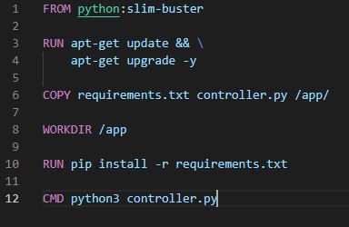

# CS_548-Assignment4
Repository for HY-548 Assignment 4. AM: csd4054
## csd4054

---

### Task 1
  * a)
		
		kubectl apply -f fruit-crd.yaml
			
  * b)
	
		kubectl apply -f fruit-basket.yaml

  * c)
	
		kubectl get fruit apple -o yaml

  * d)

        kubectl get fruits

    
			

### Task 2
  * a)

		docker build -t toutou98/greeting-controller:latest .

        docker push toutou98/greeting-controller:latest
	
        Άρχικά παίρνει το image python:slim-buster και κάνει τα updates, κατεβάζει το kubectl και
        το κάνει εγκατάσταση. Έπειτα αντιγράφει στο /app τα 3 αρχεία που χρειάζονται και κάνει
        εγκατάσταση τα requirements. Τέλος τρέχει τον controller.

	

  * b)

		Άρχικά κάνω apply το crd και το deployment:
        
        kubectl apply -f greeting-crd.yaml

        kubectl apply -f greeting-controler.yaml

        Μέσα στο deployment έχουμε ένα CLusterRole και βάζω το * στα rules για να
        είμαι σίγουρος ότι το role Θα έχει access όπου χρειάζεται. Έπειτα έχω ένα
        ClusterRoleBinding όπου κάνει reference το greeting-cluster-role και το κάνει
        bind με το service account. Τέλος είναι το deployment με το image που ανέβασα πριν.

        Για να επαληθεύσω ότι λειτουγεί σωστά μπορώ να δω με το:
        kubectl describe deployments και βλέπω ότι υπάρχουν τα σωστά δεδομένα στα deployments.

        Επίσης μπορώ να δω και τα logs του container που τρέχει το controller.py

	
	 

### Task 3
  * a)

		Προσθέτω το ssl_context στον controller για το certificate και key:

	

		Κάνω build το image:

		docker build -t toutou98/mutating-webhook-container:latest .

        docker push toutou98/mutating-webhook-container:latest

		To container είναι ένα απλό python container κάνει updates, αντιγράφει τα απαραίτητα
		αρχεία στο /app/ του container. Κάνει εγκατάσταση τα requirements και έπειτα εκτελεί
		τον controller.

	
	

  * b)

		helm repo add jetstack https://charts.jetstack.io

		helm install cert-manager jetstack/cert-manager --namespace cert-manager --create-namespace --version v1.11.0
		--set installCRDs=true

		Άλλάζω την IP του webhook.yaml στην local IP: 198.168.1.43 και βάζω το image μου.

		Φτιάχνω ένα namespace test για την δοκιμή:

		kubectl create namespace test
		kubectl label namespace test custom-label-injector=enabled

		Τώρα φτιάχνω ένα απλό pod για δοκιμή:
		
	

		Κάνουμε apply το testing-pod και στο default και στο test namespace.

		kubectl apply -f testing-pod.yaml

		kubectl apply -f testing-pod.yaml --namespace=test

		Μπορούμε να δούμε στα παρακάτω screenshots τα 2 pods στα 2 namespaces και μετά όταν κάνω get με τον
		selector παίρνω μόνο αυτό στο test namespace.
		
	

	

